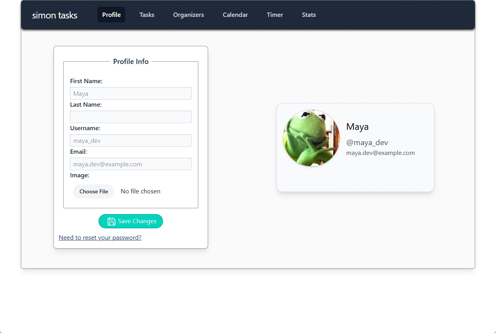

# Todo Application
A full-stack task management application built in the hopes of simplifying my own productivity workflow. Designed with a philosophy that aims to increase productivity and executive coordination whilst decreasing mental strain and energy burnout. The system reduces context-switching through task-batching, supports energy-budgetting, and even eliminates the dilemma of infinite choice. 

Projected features include smart task suggestions, time-logging, activity tracking with time/energy/context correlations, and daily check-ins for workflow optimization.
## Contents
- [Project Overview](#overview)
- [Development Roadmap](#project-status)
- [Quick Start](#quick-start)

## Overview
### Screenshots
<table>
  <tr>
    <td></td>
    <td></td>
    <td></td>
  </tr>
  <tr>
    <td align="center"><b>Login Screen</b></td>
    <td align="center"><b>Task List</b></td>
    <td align="center"><b>Profile/Settings</b></td>
  </tr>

  <tr>
    <td></td>
    <td></td>
    <td></td>
  </tr>
  <tr>
    <td align="center"><b>Create Tasks</b></td>
    <td align="center"><b>Edit Tasks</b></td>
    <td align="center"><b>Filter Tasks</b></td>
  </tr>
</table>

### Core Functionality
- **Secure Authentication:** JWT-based authentication with HTTP-only cookies for enhanced XSS protection
- **User Profile Management:** Complete profile system with image upload and customization
- **Basic Task Management:** Create, edit, delete, and organize tasks with rich metadata
- **Hierarchical Organization:** Sub-task functionality with parent-child relationships
- **Categorization:** Custom categories and flexible tagging system for task organization
- **Search & Filter:** Comprehensive search, filtering, and sorting capabilities

### Advanced Features (In Development)
- **Calendar Integration:** Weekly/daily calendar views with drag-and-drop scheduling
- **Drag-and-Drop Scheduling:** Intuitive task scheduling with calendar integration
- **Multi-View Interface:** Category views, tag views, and custom filtered views
- **Batch Operations:** Multi-select operations for efficient task management
- **Smart Planning:** Akiflow-inspired planning buckets for task prioritization
- **Daily Check-ins:** Structured workflow optimization and energy level assessments
- **Activity & Energy Tracking:** Time-based completion metrics with category and context tag correlations
- **Advanced Analytics:** Time tracking and productivity insights for workflow optimization
- **Context-Aware Planning:** Smart task batching based on category, energy level, and time of day
- **Smart Task Suggestions:** AI-powered next task recommendations (limited to 3 options to eliminate choice paralysis)

### Technologies Used
**Backend**
- **Framework:** Django 5.1+ with Django REST Framework
- **Authentication:** JWT with custom cookie-based implementation
- **Database:** PostgreSQL (docker/production), SQLite (local development)
  
**Frontend**
- **Framework:** React.js  with Vite build tool
- **HTTP Client:** Axios for API communication
- **State Management:** Custom hooks for efficient state management
- **Styling:** Tailwind CSS for responsive design
  
**Development Tools**
- **Containerization:** Docker & Docker Compose with multi-service composition
- **API Testing:** Postman for endpoint validation
- **Package Management:** Pip (Python), npm (Node.js)

## Project Status
### Phase 1: Core MVP ✅
- [x] User authentication and authorization
- [x] Basic task CRUD operations
- [x] User profile management
- [x] Sub-task functionality
- [x] Category and tag system
- [x] Task search, filter, and sort functionality
### Phase 2: Enhanced Functionality
- [x] Docker containerization setup
- [ ] Comprehensive testing suite (unit, integration, e2e)
- [ ] Responsive styling/ UX improvements
- [ ] Calendar integration with weekly/daily views
- [ ] Drag-and-drop task scheduling
### Phase 3: Analytics & Advanced Productivity Features
- [ ] Daily check-ins and workflow optimization features
- [ ] Activity tracking and completion metrics with time/energy correlations
- [ ] Time tracking and productivity analytics
- [ ] Planning buckets for task prioritization
- [ ] Task templates and recurring tasks
- [ ] Context-aware task batching and energy budgeting
- [ ] Intelligent task suggestions (w/ constraints algorithm)

## Project Structure
```
my-todo-app/
├── backend/                    # Django backend
│   ├── api/                   # API app with views and URLs
│   ├── tasks/                 # Task models and business logic
│   ├── users/                 # User models and authentication
│   ├── backend/               # Project settings and configuration
│   ├── media/                 # User uploaded files
│   ├── logs/                  # Application logs
│   ├── Dockerfile             # Backend container configuration
│   └── requirements.txt       # Python dependencies
├── frontend/                   # React frontend
│   ├── src/
│   │   ├── components/        # Reusable UI components
│   │   ├── pages/            # Main application pages
│   │   ├── hooks/            # Custom React hooks
│   │   ├── services/         # API service layer
│   │   └── utils/            # Utility functions
│   ├── public/               # Static assets
│   ├── Dockerfile            # Frontend container configuration
│   └── package.json          # Dependencies and scripts
├── docker-compose.yml         # Multi-service container orchestration
└── README.md                 # Project documentation
```

## Quick Start
**Prerequisites**
- Docker Desktop
- ~2GB free disk space for containers and images

**1. Clone the repository:**
```bash
git clone https://github.com/oskeii/simon-tasks.git
cd simon-tasks
```
**2. Start the application:**
```bash
docker compose up --build -d
```

**The application will be available at:**
- Frontend: http://localhost:3000
- Backend API: http://localhost:8000/api
- Admin Panel: http://localhost:8000/admin

**Default credentials:**

The setup automatically creates demo data and an admin user on first run. 
*You may also create a user account from the login page.*
- **Admin User:** `admin`/`adminpass123`
- **Demo User**: Check the (backend) terminal output for login credentials
```👤 Demo user: [username] / demopass123```

<!-- ### Environment Configuration
- **Development settings** are configured in docker-compose.yml
- **Database:** PostgreSQL runs in container with persistent volume
- **Media files:** Stored in Docker volume, accessible at /media/
- **Logs:** Available in backend/logs/ and via docker compose logs

### More info...
- [Docker Commands Reference]
- [Development Guide]

 -->

## License
This project is licensed under the GNU GPL v3 License - See [LICENSE](LICENSE) for details.
<!-- 
While this code is open source, please note that it represents my personal portfolio work. 
If you're a potential employer reviewing my code, welcome! If you're someone looking to build something similar, I encourage you to develop your own implementation rather than copying this project. 😅
 -->

